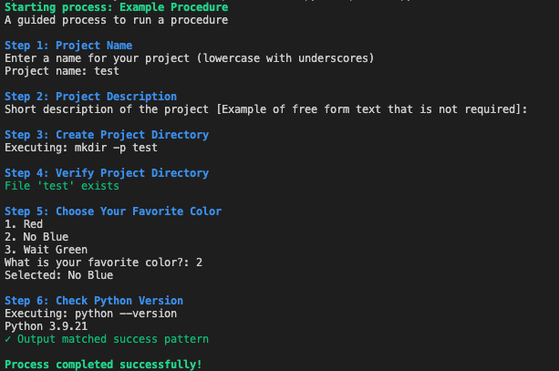

# Procedure Execution

This tool enables execution of procedures defined by YAML files.  This can guide a user through a process with various steps with validation and checking.

## Example

Below is the output for the demo.yml procedure provided in this repo.  This example shows out output can be searched for validation criteria and inputs matched against validation patterns, etc.



## Installation

If using conda make sure pip is part of the current environment. Then run

```bash
pip install -e .
```

If the `list_procedures` and `run_procedure` commands are not working, make sure the correct python path is used with

```bash
sed -i "1s|.*|#!$(which python)|" $(which list_procedures)
sed -i "1s|.*|#!$(which python)|" $(which run_procedure)
```

You can define a location for procedures by setting PROCEDURE_DIR in your environment.  If not set, the default is `./procedures`.

## Usage

```bash

# List available procedures
list_procedures

# Run a procedure
run_procedure <procedure_id>
```

